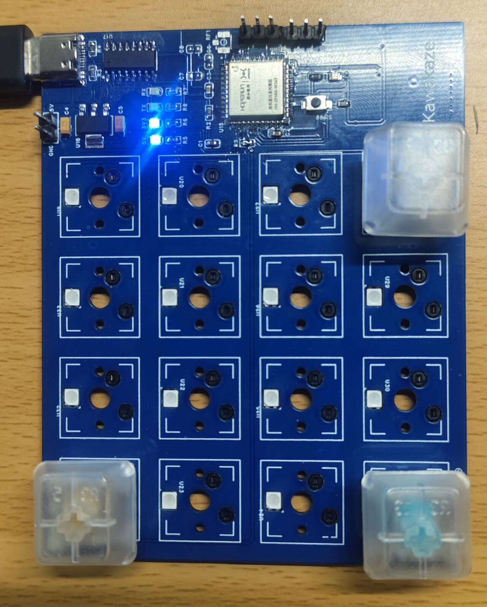
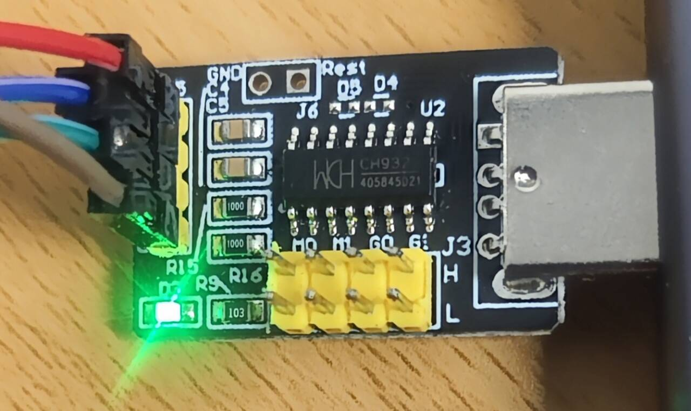
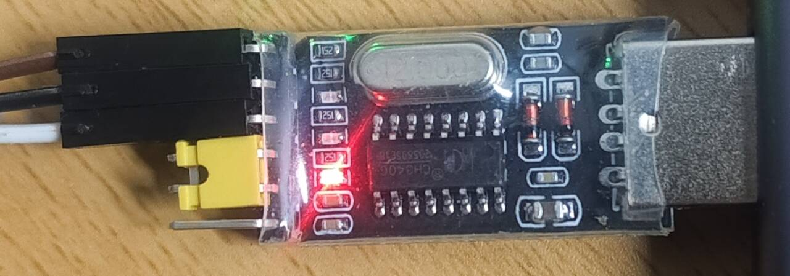
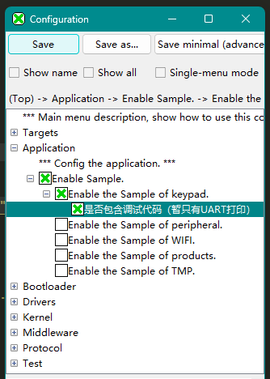

# Maker-Desktop
创客桌面

## 预备

###### 1. 开发环境搭建
- [BearPi__ws63-SDK](https://www.bearpi.cn/core_board/bearpi/pico/h3863/)

###### 2. ws63-SDK
- [Gitee__BearPi-Pico-H3863-SDK](https://gitee.com/bearpi/bearpi-pico_h3863)

###### 3. 小矩阵键盘


###### 4. 通信模块




---

## 配置

###### 1. 下载 本代码
- 下载后，直接放到 ***SDK/application/samples/*** 目录下

###### 2. **配置 *Kconfig***
- 打开 ***SDK/application/samples/Kconfig*** ，添加
```kconfig
config ENABLE_KEYPAD_SAMPLE
    bool "Enable the Sample of keypad."
    default y
    depends on SAMPLE_ENABLE
    help
        This option means enable the sample of keypad.
        
if ENABLE_KEYPAD_SAMPLE
osource "application/samples/keypad/Kconfig"
endif
```

###### 3. **配置 *CMakeLists.txt***
- 打开 ***SDK/application/samples/CMakeLists.txt*** ，添加
```cmake
if(DEFINED CONFIG_ENABLE_KEYPAD_SAMPLE)
    add_subdirectory_if_exist(keypad)
endif()
```

---

## 说明

###### 1. 调试代码
- 默认不包含 调试代码 ，**编译前** 可在 *Kconfig* 中开启
 

- 可用的调试函数: debug_uart_print()

- 取消 调试代码 后，调用调试函数之处将自动被 **宏替换** 为空语句
> 详见 `keypad/comm/uart/uart.h`

- 调试代码所用 UART 与 项目不同，不会冲突，默认情况下：
>		debug_uart_bus_id = 0
>		uart_bus_id = 1

- 若将 uart_bus_id 设为 0，debug_uart_bus_id会自动改用 1
> 详见 `keypad/comm/uart/uart_cfg_def.h`

---

## 其他

1. 暂未考虑 **按键消抖** ，鬼键多多
2. 键盘扫描为 **硬编码** ，不可移植

