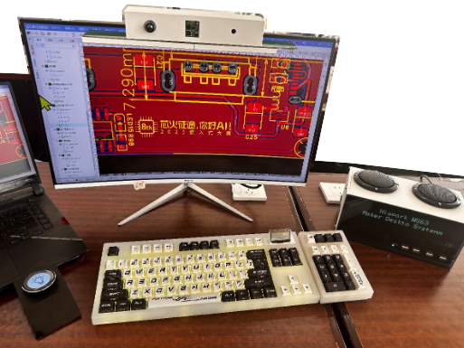
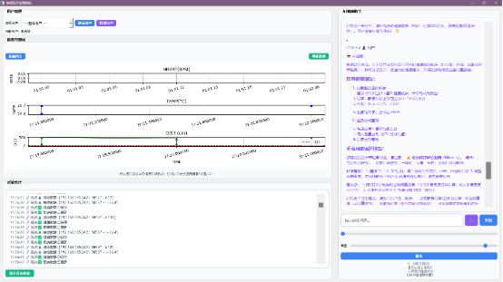
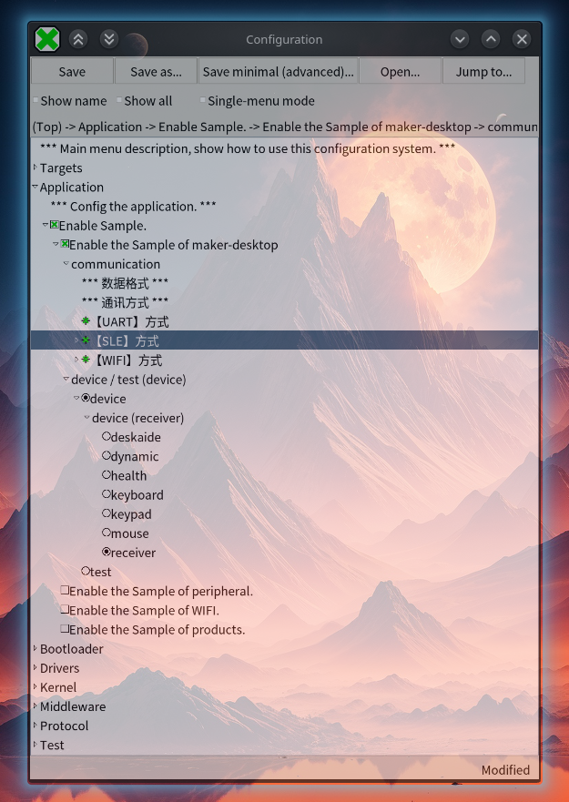
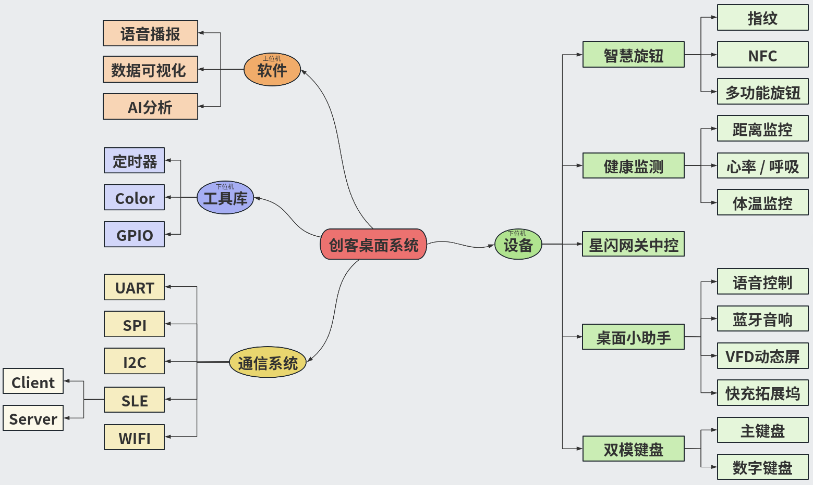
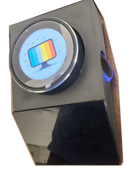
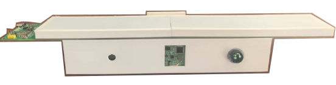
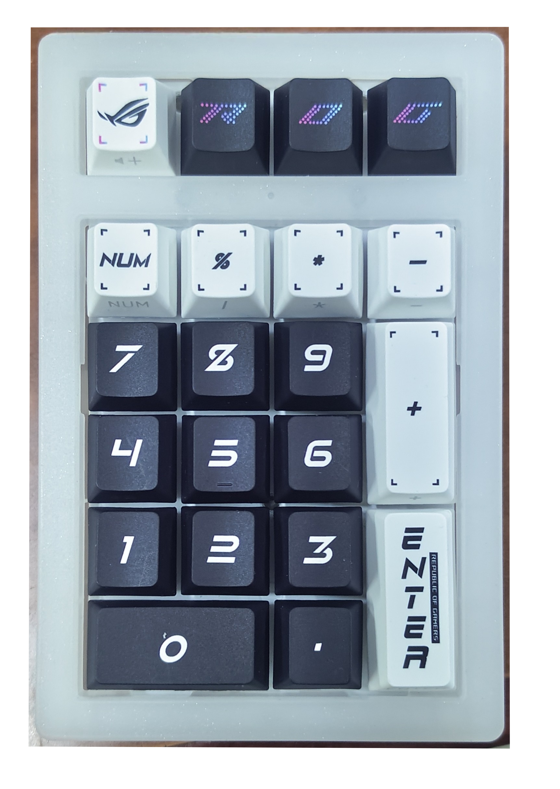
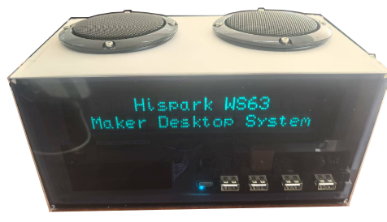
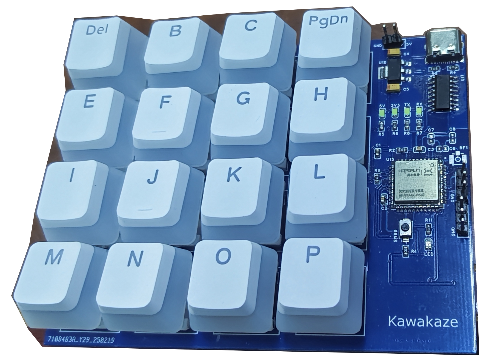

# Maker-Desktop 创客桌面

## 1. 项目简介

本项目是一个基于 `Hi3863` 的智慧健康桌面系统。

与将所有功能集成在一个固件中的传统项目不同，本项目设计的核心理念是 **“单一功能、分时开发”**。在任意时刻，系统都只专注于某一个特定的功能模块(例如“智慧旋钮”或“星闪网关中控”)。开发者可以通过修改配置，轻松切换当前要运行的“下位机应用”，从而实现对不同硬件原型和软件功能的独立开发、调试与验证。

目前，项目内置了 **星闪网关中控**、**智慧旋钮**、**健康监测**、**主键盘**、**小键盘** 和 **桌面助手** 等多个可独立工作的应用模块。





## 2. 环境部署(KUbuntu)

### 2.1. 预备

1. 基础准备

    - **CH340** 驱动：[CH340驱动_Linux](https://www.wch.cn/downloads/CH341SER_LINUX_ZIP.html)

    > 用于连接串口设备

    - **winehq** (>=10.0)：[winehq 官网](https://www.winehq.org/)

    > wine 用于运行 **BurnTool_H3863.exe**

    - **python**版本：3.11.4 - 3.12

    > - 需要安装 **kconfiglib** 库
    > - 官方要求 3.11.4；版本若  >= 3.13，至少 build.py 需改为：

    ``` python
    import os
    import sys
    from shutil import which

    sys.dont_write_bytecode = True
    root_dir = os.path.split(os.path.realpath(__file__))[0]
    sys.path.append(os.path.join(root_dir, 'build', 'config'))
    sys.path.append(os.path.join(root_dir, 'build', 'script'))

    from cmake_builder import CMakeBuilder

    def check_enviroment():
        if not which("cmake"):
            print("cmake is not installed or not added to system path.")
        if not which("ninja") and not which("make"):
            print("make/ninja is not installed or not added to system path.")

    builder = CMakeBuilder(sys.argv)

    builder.build()
    ```

    - 官方SDK源码：[Gitee ws63-SDK](https://gitee.com/bearpi/bearpi-pico_h3863)
    - 官方ws63文档：[BearPi ws63-Doc](https://www.bearpi.cn/core_board/bearpi/pico/h3863/)
    - 本项目源码：[Github Maker-Desktop](https://github.com/Rinux-0/Maker-Desktop.git)
    - 本项目硬件：[嘉立创 Maker-Desktop](...)

    > 将 `maker-desktop` 放至 SDK 的 `application/samples/` 目录下，若有文件冲突请选择 **覆盖**

2. 进一步配置(可选)

    - **gui-kconfig**：在 linux 上为kconfig配置GUI界面

    > 1. 获取 Windows版 的 **Hispark Studio** 中的插件： `HiSpark Studio/resources/app/extensions/huawei.cfbb-kconfig-0.0.1`
    > 2. 将该插件置于 SDK 的根目录下
    > 3. 进入 SDK 的根目录，并运行 `python "huawei.cfbb-kconfig-0.0.1/configHandler/show_config.py" "config.in ws63 acore ws63-liteos-app build/config/target_config/ws63/menuconfig/acore" "guiconfig"`

    

3. 其他

    - **重编译**命令建议改为： `python ./build.py -c -release ws63-liteos-app`

    > 一般情况下，不需要其中的 debug 模式，且改为 release 模式 可一定程度上提高编译速度

### 2.2. 编译说明(我的环境)

- 编译环境：KUbuntu 25.04
- 编译工具：GCC 14.2.0
- python 版本：3.13
- CMake 版本：3.31.6

> CMake 不支持 4.x 版本

## 3. 系统框图



## 4. 软件架构：分层与分发

### 4.1. 项目总结构

``` text
.
├── comm                   *- 通讯驱动层
│   ├── format                  - 数据包格式
│   │   └── hid                     - HID协议
│   ├── i2c                     - I2C协议
│   ├── sle                     - 星闪协议
│   ├── spi                     - SPI协议
│   ├── uart                    - UART协议
│   └── wifi                    - WIFI协议
│
├── device                 *- 设备应用层
│   ├── deskaide                - 桌面助手(server)
│   │   ├── asrpro                  - 语音识别
│   │   ├── sound                   - 蓝牙音响
│   │   └── vfd                     - VFD显示屏
│   ├── dynamic                 - 智慧旋钮(server)
│   │   ├── fingerprint             - 指纹
│   │   ├── knob                    - 旋钮
│   │   └── nfc                     - 近场通信
│   ├── health                  - 健康监测(server)
│   │   ├── lamp                    - 屏幕挂灯
│   │   ├── rate                    - 呼吸 / 心率
│   │   └── temperature             - 测温
│   ├── keyboard                - 主键盘(server)
│   ├── keypad                  - 数字键盘(server)
│   └── receiver                - 星闪网关中控(client)
│
├── test                   *- 单元测试层
│   ├── keytest                 - 按键测试(server)
│   └── tmptest                 - 临时测试
│       ├── multi_thread            - 多线程测试
│       └── receiver                - 接收器测试(server)
│
└── util                   *- 通用工具层
    ├── color                   - RGB
    │   ├── color_ctrl.c            - 控制
    │   └── mode                    - 预设模式
    ├── ddef.h                  - 公用定义
    └── tool
        ├── ttimer.c            - 定时器
        └── ttool.c             - 其他工具(delay / sleep / gpio)
```

### 4.2. 架构分层

整个项目框架被清晰地划分为三个层次：

- **通信协议层 (`comm/`)**: 为设备层提供通信能力的公共服务层。它封装了 `SLE`, `UART`, `SPI`, `I2C` 等多种通信协议的底层实现。
- **设备应用层 (`device/`)**: 项目的核心业务逻辑层。该层包含所有可独立运行的具体设备应用。在任意一次编译中，只有被选中的那一个设备应用是活跃的。
- **单元测试层 (`test/`)**: 为开发者提供单元测试的工具层。它封装了 `keytest` 等测试用例，并提供多线程测试的支持。
- **通用工具层 (`util/`)**: 提供与业务无关的、最底层的通用服务，如日志打印、定时器、看门狗等。

``` text
.
├── comm    *- 通讯驱动层
├── device  *- 设备应用层
├── test    *- 单元测试层
└── util    *- 通用工具层
```

### 4.3. “宏分发链”设计模式

为了实现“单一应用切换”，设备层采用了一种巧妙的“宏分发链”模式：

1. **初级分发 (`demo.c`)**: `demo.c` 中的 `INIT(DEMO_NAME)()` 会被预处理器替换为 `device_init()`，将执行权交给设备层分发器。
2. **次级分发 (`device.c`)**: `device.c` 中再次调用 `INIT(DEVICE_NAME)()`，此时宏会被替换为具体设备的初始化函数，如 `dynamic_init()`，从而将执行权精确地交给最终选定的设备应用。

整个流程 `demo.c -> device.c -> dynamic.c` 完全在编译时确定，运行时零开销。

### 4.4. 通信层设计模式

与设备层“一次只跑一个”不同，通信层采用“多路并发”的设计。

- **按需编译**: `comm.c` 通过 `#if defined(CONFIG_COMM_...)` 条件编译，将设备层所依赖的所有通信模块全部编译进来。
- **统一初始化**: `comm_init()` 会依次调用所有需要的通信模块的初始化函数。
- **核心枢纽**: `comm.c` 中的 `sle_r_int_uart_handler` 等回调函数，是实现 `SLE` 无线与 `UART` 有线之间数据透传和协议转换的核心，是整个框架数据交互的灵魂。

## 5. 功能模块

### 5.1. 星闪网关中控 (Receiver)


- **Kconfig 选项**: `DEVICE_RECEIVER`
- **角色**: `SLE` 客户端 (Client)
- **核心功能**: 作为一个专用的无线数据接收器。它通过 `SLE` 协议接收来自各个服务端设备的数据，并通过 `comm.c` 中的核心枢纽函数，将接收到的数据从 `UART` / `SLE` / `WIFI` 接口转发出去。
- **关键源码**: `device/receiver/receiver.c`
- **主要接口**: `rcv_sle_r_int_handler()` 是 `SLE` 接收中断回调，负责解析来自服务端的数据并进行相应处理。

### 5.2. 智慧旋钮 (Dynamic)(多线程)



- **Kconfig 选项**: `DEVICE_DYNAMIC`
- **角色**: `SLE` 服务端 (Server)
- **子模块**:
  - `fingerprint`: 指纹识别模块
  - `knob`: 旋钮模块
  - `nfc`: NFC模块
- **核心功能**:
  - 旋钮将旋转、按压等事件存入特定寄存器，主控通过定时轮询向旋钮发送指令来查询状态，解析后通过 `SLE` 网络广播。
  - 指纹和NFC都支持GPIO中断，由主控检测后，通过 `UART` 获取数据并用 `SLE` 广播。
- **关键源码**: `dynamic/fingerprint/fingerprint.c`, `dynamic/nfc/nfc.c`, `dynamic/knob/knob.c`
- **主要接口**:
  - `knob_write_cmd()`: 向旋钮发送指令，查询其状态。
  - `knob_uart_r_int_handler()`: `UART` 接收中断回调，负责解析旋钮上报的数据。
- **可配置项**: `device/dynamic/knob/knob.c` 中定义了与旋钮通信的指令集,可先配置旋钮后，根据需要修改指令集 。

### 5.3. 健康监测 (Health)(多线程)



- **Kconfig 选项**: `DEVICE_HEALTH`
- **角色**: `SLE` 服务端 (Server)
- **核心功能**:
  - 通过 `I2C` / `UART`  协议与外部健康传感器(如呼吸心率、温度、距离传感器)通信，定时读取传感器数据，并通过 `SLE` 网络广播。
  - lamp: 灯光模块，通过 双路PWM 控制，可分别控制灯光的亮度、颜色等。
- **关键源码**: `health/health.c`, `health/rate/rate.c`, `health/temperature/temperature.c`, `health/lamp/lamp.c`

### 5.4. 主键盘 / 小键盘(Keyboard / Keypad)




- **Kconfig 选项**: `DEVICE_KEYBOARD` / `DEVICE_KEYPAD`
- **角色**: `SLE` 服务端 (Server)
- **核心功能**:
  - 通过硬件 `SPI` 驱动一个键盘RGB。可控制RGB的亮度、颜色、变速、预制模式等。(详见`/util/color`)
  - 通过周期性地执行全键扫描，实时获取按键状态，并将按键事件封装成 `HID` 指令，通过 有线`UART` / 无线`SLE` 发送数据。
- **关键源码**: `device/keypad/core/kpd_core.c`, `device/keyboard/core/kbd_core.c`
- **主要接口**:`_read_now()`，`_fn_processer()`，`_set_kbd_hid_wp()`

### 5.5. 桌面助手 (Desk Aide)(多线程)



- **Kconfig 选项**: `DEVICE_DESKAIDE`
- **角色**: `SLE` 服务端 (Server)
- **核心功能**: 一个功能丰富的 `SLE` 服务端应用集合，。
- **关键源码**: `device/deskaide/deskaide.c`
- **子模块**:
  - `asrpro`: 语音识别模块，可通过 `UART` 接收指令，通过 `SLE` 上报结果
  - `sound`: 声音播放模块
  - `vfd`: 真空荧光显示屏模块
  - `USB-HUB`：USB 集线器模块，支持快充、数据传输等功能。(详见硬件设计方案)

## 6. 测试模块

### 6.1. 按键测试 (Keytest)



- **Kconfig 选项**: `TEST_KEYTEST` (在顶层`Kconfig`中将`device`切换为`test`后可见)
- **核心功能**: 专用的键盘调试模块。它会接管键盘的输入，但不通过 `SLE` 上报，而是将原始键值直接从调试 `UART` 打印出来，用于验证键盘矩阵扫描的正确性。

### 6.2. 临时测试 (Tmptest)

- **Kconfig 选项**: `TEST_TMPTEST`
- **核心功能**: 一个用于快速开发和验证临时代码片段的“沙盒”模块。开发者可以在此模块下创建新的子目录(如`multi_thread`)，编写测试代码，而无需干扰主 `device` 分支的任何逻辑。

---
本 README 最后更新于 *2025-7-12*
