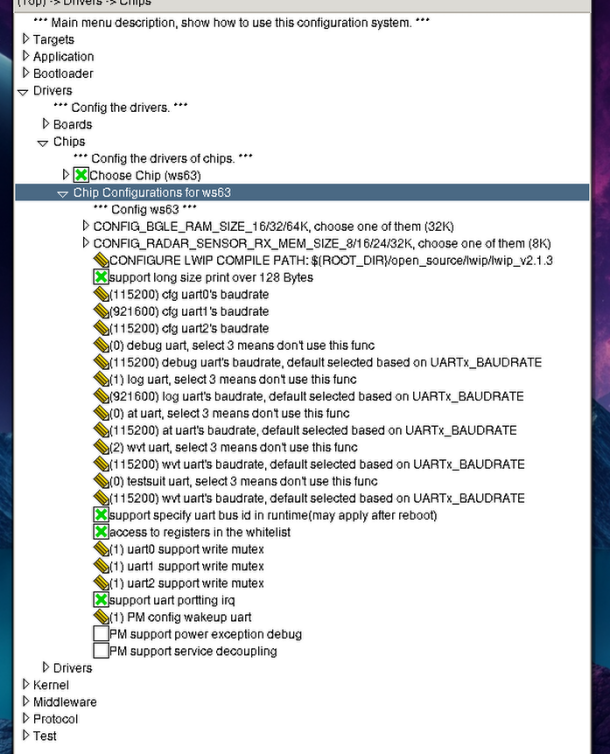

# Maker-Desktop 创客桌面

    本 readme 聚焦 kubuntu 介绍该项目的开发环境配置

## 1. 项目简介

本项目是 *2025年全国大学生**嵌入式**芯片设计大赛应用赛道**海思**赛题* 的作品。

1. 硬件层面，采用润和ws63裸片，自主设计原理图、PCB并焊接调试
2. 软件层面，上下位机联合开发，多语言配合，全程linux开发

## 2. 主要结构

``` text
.
├── host                                            # 上位机
│   ├── backend                                     # 后端
│   │   ├── app
│   │   │   ├── ai_aide
│   │   │   ├── health
│   │   │   ├── offstage
│   │   │   └── user
│   │   ├── backend_start.sh                        # 后端启动脚本
│   │   ├── config
│   │   │   ├── config.py
│   │   │   ├── key.py
│   │   │   └── orm.py
│   │   ├── database
│   │   │   └── back.db
│   │   ├── file
│   │   │   └── audio
│   │   │       ├── input.wav
│   │   │       └── output.wav
│   │   ├── main.py                                 # 后端主程序
│   │   ├── migrations
│   │   ├── model
│   │   │   ├── ai.py
│   │   │   ├── health.py
│   │   │   ├── log.py
│   │   │   └── user.py
│   │   └── util
│   └── frontend                                    # 前端
│       ├── auto-imports.d.ts
│       ├── components.d.ts
│       ├── dist
│       ├── .eslintrc.js
│       ├── file
│       ├── frontend_start.sh                       # 前端启动脚本
│       ├── index.html
│       ├── package.json
│       ├── package-lock.json
│       ├── src
│       │   ├── App.vue
│       │   ├── components                          # 前端组件
│       │   │   ├── ai-sidebar
│       │   │   ├── health-monitor
│       │   │   ├── system-monitor
│       │   │   └── user-management
│       │   ├── layout
│       │   ├── main.js
│       │   ├── router
│       │   ├── stores
│       │   ├── style
│       │   ├── utils
│       │   │   └── api.js
│       │   └── views
│       │       └── dashboard
│       │           └── index.vue
│       └── vite.config.js                          # 前端配置
├── patch                                           # 补丁
│   ├── btn-tasks.txt
│   ├── chmod_com.sh
│   ├── CMakeLists.txt
│   ├── huawei.cfbb-kconfig-0.0.1
│   ├── Kconfig
│   └── slave -> ../../../../
├── pyproject.toml
├── .python-version
├── slave                                           # 下位机
│   ├── comm                                        # 通信模块
│   │   ├── format                                  # 通信协议格式
│   │   │   └── hid
│   │   │       ├── ch9329
│   │   │       └── xxx
│   │   ├── i2c
│   │   ├── sle                                     # 星闪
│   │   │   ├── client
│   │   │   └── server
│   │   ├── spi
│   │   ├── uart
│   │   └── wifi
│   │       ├── http                                # http通信
│   │       └── wifi                                # wifi连接
│   ├── device                                      # 设备模块
│   │   ├── deskaide                                # 桌面助手
│   │   │   ├── asrpro
│   │   │   ├── sound
│   │   │   ├── usbhub
│   │   │   └── vfd
│   │   ├── dynamic                                 # 智慧旋钮
│   │   │   ├── fingerprint
│   │   │   ├── knob
│   │   │   └── nfc
│   │   ├── health                                  # 健康监测挂灯
│   │   │   ├── distance
│   │   │   ├── lamp
│   │   │   ├── rate
│   │   │   └── temperature
│   │   ├── keyboard
│   │   ├── keypad
│   │   └── receiver                                # 星闪网关中控
│   ├── README.md
│   ├── test                                        # 测试
│   └── util                                        # 通用库
│       ├── color                                   # ws2812
│       ├── ddef.h                                  # 通用定义
│       └── tool                                    # 工具库
├── uv.lock
└── .vscode
    ├── launch.json
    └── tasks.json
```

## 3. 技术栈

- 上位机
  - 前端: vue3 + css + html
  - 后端: python + fastapi + tortoise-orm + sqlite
- 下位机: linux + c/c++ + python + kconfig + cmake

## 4. 资源预备

1. 系统开发环境
    - [kubuntu 25.04](https://kubuntu.org/getkubuntu/)
    - [arch linux](https://mirrors.aliyun.com/archlinux/iso/2025.08.01/)
    - [windows 11 24h2](https://www.microsoft.com/en-us/software-download/windows11)
    > - 本项目完全基于 linux , windows 相关配置请自行探索
    > - 不推荐 windows, 编译极慢
    > - 不推荐 arch, 配置复杂

2. python 环境
    - linux: [uv 0.8.11](https://uv.doczh.com/getting-started/installation/), python 3.12.11
    - windows: [miniconda](https://www.anaconda.com/download/success), python 3.12.11
    > - 本项目 python 环境完全基于 uv , conda 相关配置请自行探索
    > - 截至撰写时间, **不支持 python 3.13及以上版本**

3. C/C++ 环境
    - [gcc](https://gcc.gnu.org/)系列 14.2
    - [clang](https://releases.llvm.org/download.html)系列 20.1.2

4. 开发工具
    - [vscode](https://code.visualstudio.com/) (刚需)
    - [pycharm_pro](https://www.jetbrains.com/pycharm/download/) (可选)
        > pycharm 主要用于上位机**后端**开发，**数据库**相关操作要求 pro 版本

5. 代码托管
    - [git 2.48.1](https://git-scm.com/downloads)

6. 上位机
    - 前端: [npm 10.8.2](https://nodejs.org/zh-cn/download)

7. 下位机
    - windows模拟: [winehq](https://gitlab.winehq.org/wine/wine/-/wikis/zh_CN/Download) (>=10.0)
        > wine 用于**一定程度**上模拟 windows 系统环境，以运行 exe 等程序。本项目中需要模拟 BurnTool_H3863 和 qcom
    - 烧录工具: [BurnTool_H3863](https://www.bearpi.cn/core_board/bearpi/pico/h3863/filebrowser/?path=7036653)
    - 串口 <-> USB 驱动: [CH340](https://www.wch.cn/downloads/CH341SER_EXE.html)
    - 串口 -> USB_HID 配置工具: [CH9329](https://www.wch.cn/products/CH9329.html)
    - 串口调试工具:
      - linux / windows: [波特律动(web)](https://serial.baud-dance.com/#/)(edge可用) / [qcom](https://www.bearpi.cn/core_board/bearpi/pico/h3863/filebrowser/?path=7036653)
      - linux: [minicom](https://pkgs.org/download/minicom)
      - windows: [sscom](https://soft.3dmgame.com/down/247967.html) / ...
        > - windows 可选的工具很多, 相关配置可自行探索
        > - 模拟的 qcom 在压力过大/操作不当时, 会崩溃/未响应，可用任务管理器**强制杀死**"wineserver"进程

    > 上述部分资源可用包管理器直接安装, 如 apt/yum/pacman/...
    >
    > **注**：若后续步骤提示“找不到...”/“缺少...”，可能是以上某资源安装时使用（或未使用）sudo 导致安装位置不同, 请尝试不使用（或使用）sudo 执行安装

## 5. 项目配置

    默认读者已经预备好上述资源, 接下来将介绍项目配置过程

1. python:
    1. 项目根目录生成并激活 .venv 虚拟环境

        ``` bash
        uv venv && source .venv/bin/activate
        ```

    2. 同步项目要求的 uv-python 依赖

        ``` bash
        uv sync
        ```

2. vscode:
    1. 将 `./patch` 中的 `slave` `CMakeLists.txt` `Kconfig` 文件 copy/move 到 `./slave/sdk/bearpi-pico_h3863/application/samples/` 目录下
        > 若提示重名，请直接覆盖

    2. 插件 "Task Buttons":
        右击该插件 > 设置 > **工作区** > settings.json中编辑 > "VsCodeTaskButtons.tasks"中加入以下配置

        ``` json
        {
            "label": "🛠️",
            "task": "config",
            "tooltip": "config"
        }, {
            "label": "📚",
            "task": "rebuild",
            "tooltip": "rebuild"
        }, {
            "label": "📥",
            "task": "burn",
            "tooltip": "burn"
        }, {
            "label": "📳",
            "task": "qcom",
            "tooltip": "qcom"
        }, {
            "label": "🔒",
            "task": "chmod_com",
            "tooltip": "chmod_coms"
        }
        ```

        > 上述配置已记载在 `./patch/btn-tasks.txt` 中

    3. `./host/backend/config`:
        将 `key.py-sample` 改名为 `key.py` 并填写相关信息

    4. `./host/backend/database`:
        若无数据库文件, 请将 `back.db-sample` 改名为 `back.db`

    5. `./host/frontend/vite.config.js`:
        将第30行的url改为自己实际使用的后端地址
        > - port: 已固定为 8749
        > - ip: 需要读者在终端自查
        >   - linux: `ifconfig`
        >   - windows: `ipconfig`
        >
        > **注**: 上下位机需接同一局域网

    6. 烧录设置:
        1. 打开烧录工具(**rebuild后才能成功打开**) > Setting >
            - Select file > ws63-liteos-app_all.fwpkg
        2. 烧录工具 > Setting > Save Config ( > Overwrite config file )
        > com = ttyUSB + 1
        >
        > **注**："Connect" 前 需先 关闭其他占用当前com口的程序，并 chmod 对于com口的读写权限为 **777**
        >
        > **注**: 每次打开烧录工具，都需进行如下操作:
        > - Settings > Reset after success (**刚需**)
        > - Burn Interval > 2ms (可选)

## 6. 其他

1. ws63_sdk的 `open_sourse` 中有一些其他可用模块，举例如下：
    - mqtt: 可用于替代下位机的 `receiver` 中的 `http` , 开发效果更佳
        > 可 bing 搜索 "ws63 mqtt" 了解相关开发说明
    - littlefs: 功能即 ROM
        > 相关开发需读者**自行摸索**（亲测可实现）

2. 在下图位置可控制串口的默认初始化
    

---

> 最后编辑时间: **2025-08-16**
>
> 如有问题, 请联系作者 **QQ: 3690366013**
